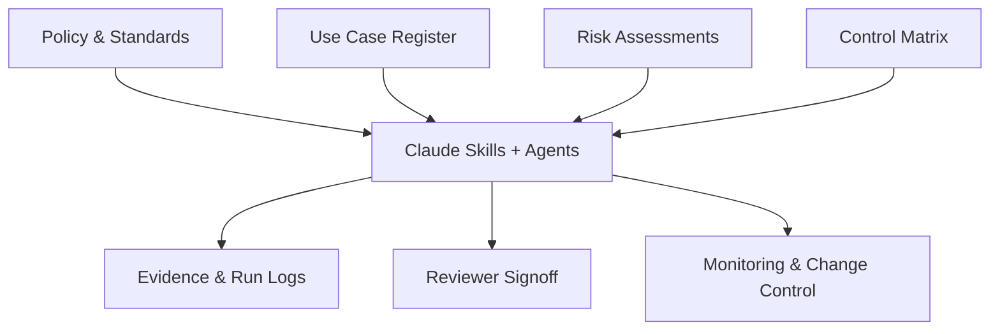

# Finance AI Governance

*A controller-led starter repository for responsible AI adoption in accounting and finance*

---

This repository demonstrates how AI governance can be implemented directly inside a development environment using Claude and VS Code. Rather than treating governance as a separate compliance exercise, this approach embeds policy, risk assessment, and control evidence into the same workspace where AI-assisted work actually happens.

The structure follows [COSO 2026](https://www.coso.org/) internal control principles, adapted for AI workflows in accounting and finance. A controller or finance leader can use this repository as a starting point to stand up a lightweight governance framework without waiting for enterprise-wide AI programs.

## How It Fits Together



Policy, risk assessments, and controls feed into Claude skills and agents. Every execution produces evidence, requires reviewer signoff, and is subject to monitoring and change control.

## Repository Structure

```
finance-ai-governance/
  agents/           # Claude agent definitions for approved workflows
  assessments/      # Risk assessments for each approved use case
  docs/             # Governance policy, standards, and reference material
  evidence/         # Timestamped output, run logs, and reviewer checklists
  examples/         # Sample data and worked examples (synthetic only)
  inventory/        # Approved use-case register and classification records
  skills/           # Claude skill definitions (.md files)
  toolkit/          # Reusable templates, scripts, and helper tools
  .claude/          # Claude settings and permissions
  CLAUDE.md         # Operating rules loaded automatically by Claude
```

## Getting Started

1. **Clone the repository**
   ```bash
   git clone https://github.com/PythonMuse/finance-ai-governance.git
   ```

2. **Open in VS Code with Claude Code**
   Claude will automatically read `CLAUDE.md` and apply the operating rules defined there. The `.claude/settings.json` file enforces permission boundaries.

3. **Customize for your organization**
   - Update `docs/` with your company's AI policy and standards.
   - Add approved use cases to the register in `inventory/`.
   - Complete a risk assessment in `assessments/` for each use case.
   - Define Claude skills in `skills/` that reference the controls.

## Start Small

You do not need to automate everything at once. Pick one use case -- bank reconciliation is a good starting point -- and build the full governance path for it:

1. Add it to the use-case register.
2. Complete the risk assessment.
3. Map controls in the control matrix.
4. Build a Claude skill that enforces those controls.
5. Run it, capture evidence, and get reviewer signoff.

Once that loop is working, expand to the next use case.

## Learn More

This repository is a companion to the PythonMuse article series on AI in accounting and finance:

[AI Governance for Controllers](https://github.com/PythonMuse/ai-ledger/tree/main/articles/07-ai-governance-for-controllers)

---

## License

This project uses a dual license:

- **Written content** (governance documents, templates, assessments, skills, examples, documentation) is licensed under [CC BY-NC-SA 4.0](LICENSE) — you may share and adapt with attribution, for non-commercial purposes, under the same license.
- **Python source code** (`.py` files) is licensed under the [MIT License](LICENSE-CODE) — free to use, modify, and distribute.

See [LICENSE](LICENSE) and [LICENSE-CODE](LICENSE-CODE) for full details.

---

*By Svetlana Toohey -- [PythonMuse](https://github.com/PythonMuse/ai-ledger)*
